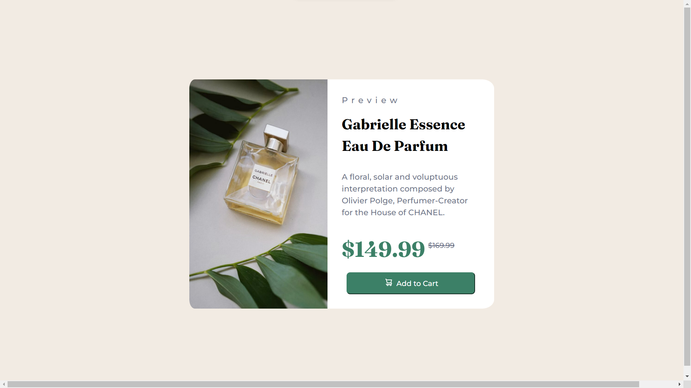
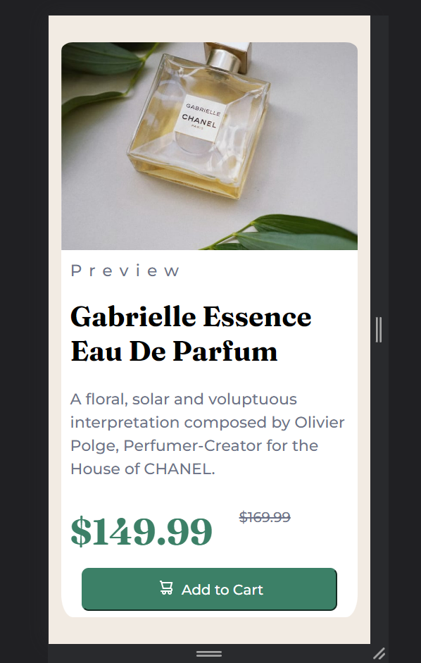

# Frontend Mentor - Product preview card component solution

This is a solution to the [Product preview card component challenge on Frontend Mentor](https://www.frontendmentor.io/challenges/product-preview-card-component-GO7UmttRfa). Frontend Mentor challenges help you improve your coding skills by building realistic projects.

## Table of contents

  - [The challenge](#the-challenge)
  - [Screenshot](#screenshot)
  - [Links](#links)
  - [Built with](#built-with)
  - [What I learned](#what-i-learned)
  - [Continued development](#continued-development)
  - [Useful resources](#useful-resources)
- [Author](#author)

### The challenge

Users should be able to:

- View the optimal layout depending on their device's screen size
- See hover and focus states for interactive elements

### Screenshot





### Links

- Solution URL: [https://github.com/AmanGupta1703/ProductCard]
- Live Site URL: [https://amangupta1703.github.io/ProductCard/tree/main/product-preview-card-component-main]
- Live Site URL: [https://amangupta1703.github.io/ProductCard/tree/main/phone-design]


### Built with

- Semantic HTML5 markup
- CSS custom properties
- Flexbox

### What I learned

```html
<h3 class="preview">Preview</h3>
<h1 class="product-content-title">Gabrielle Essence Eau De Parfum</h1>
<p class="product-content-text">
  A floral, solar and voluptuous interpretation composed by Olivier Polge,
  Perfumer-Creator for the House of CHANEL.
</p>
<div class="updated-price">
  <p class="new-price">$149.99</p>
  <p class="old-price">$169.99</p>
</div>
```

```css
.updated-price {
  display: flex;
  position: relative;
  margin-top: 2rem;
}

.new-price {
  color: hsl(158, 36%, 37%);
  font-family: "Fraunces", serif;
  font-size: 3rem;
}

.old-price {
  color: hsl(228, 12%, 48%);
  position: absolute;
  left: 12rem;
  bottom: 2rem;
  text-decoration: line-through;
}

.add-to-cart {
  background-color: hsl(158, 36%, 37%);
  border-color: hsl(158, 36%, 37%);
  border-radius: 8px;
  color: hsl(0, 0%, 100%);
  cursor: pointer;
  display: block;
  font-size: 1rem;
  font-family: "Montserrat", sans-serif;
  margin: 0 auto;
  margin-top: 1rem;
  padding: 4% 26%;
}

.add-to-cart:hover {
  background-color: hsl(212, 21%, 14%);
  border-color: hsl(212, 21%, 14%);
}
```

### Continued development

1) FlexBox
2) Position
3) Measurement Units

### Useful resources

- [GeeksForGeeks -> Hover](https://www.geeksforgeeks.org/css-hover-selector/?ref=lbp)
- [W3Schools -> Positioning](https://www.w3schools.com/css/css_positioning.asp) 
- [W3Schools -> Flexbox](https://www.w3schools.com/css/css3_flexbox.asp) 
- [W3Schools -> Units](https://www.w3schools.com/cssref/css_units.asp) 

## Author

- Website - [Product Site](https://amangupta1703.github.io/ProductCard/tree/main/product-preview-card-component-main)
- Website - [Product Site-Mobile-Design](https://amangupta1703.github.io/ProductCard/tree/main/phone-design)
- Frontend Mentor - [@AmanGupta1703](https://www.frontendmentor.io/profile/AmanGupta1703)
